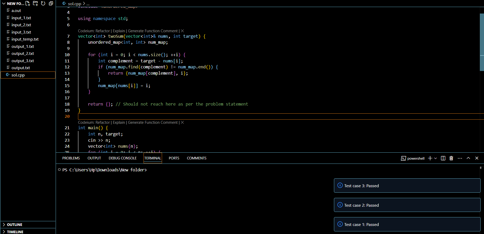
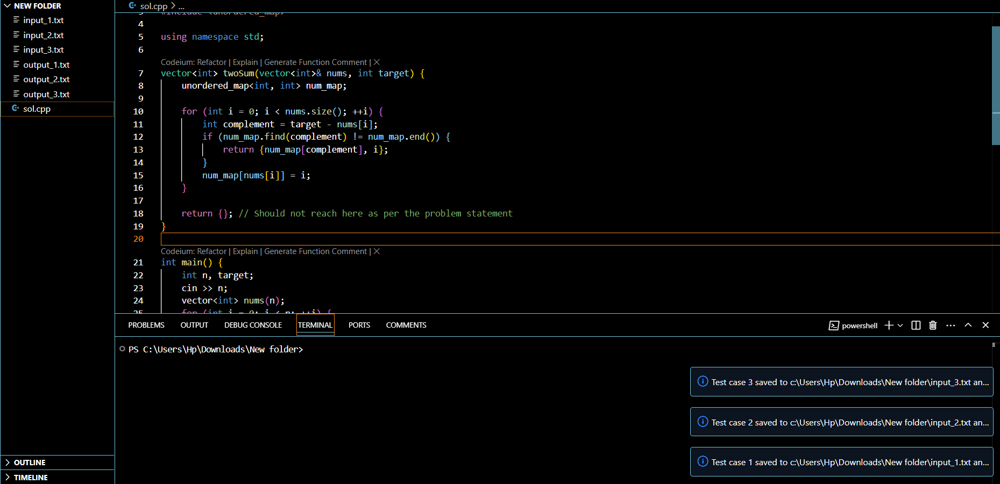

# Tinkering Labs Open Project - VS Code X Leetcode Extension  
VS Code X Leetcode Extension is a VS Code plugin tailored to optimize competitive programming routines by embedding Leetcode capabilities directly into the IDE.  

## What you can do with this  
- Compatible with LeetCode.  
- Retrieve example test cases for questions and save them locally.  
- Execute code against stored test cases directly within VS Code, displaying results instantly.  
- Highlights mismatches when the actual output differs from the expected output.  

## Extension Screenshots  
Here are some demo screenshots of the extension in action:  

### Screenshot 1  
  
> Upon running the 'Fetch Leetcode Test Cases' and putting the leetcode question description link as the input, all the available test cases are fetched.

### Screenshot 2  
  
> Upon running the command 'Run test cases', and putting the path of the solution file as the input, an output is generated.

## Demo Video  
Check out the demo video to see the extension in action:  

  

> Click the image above to watch the demo video.  

